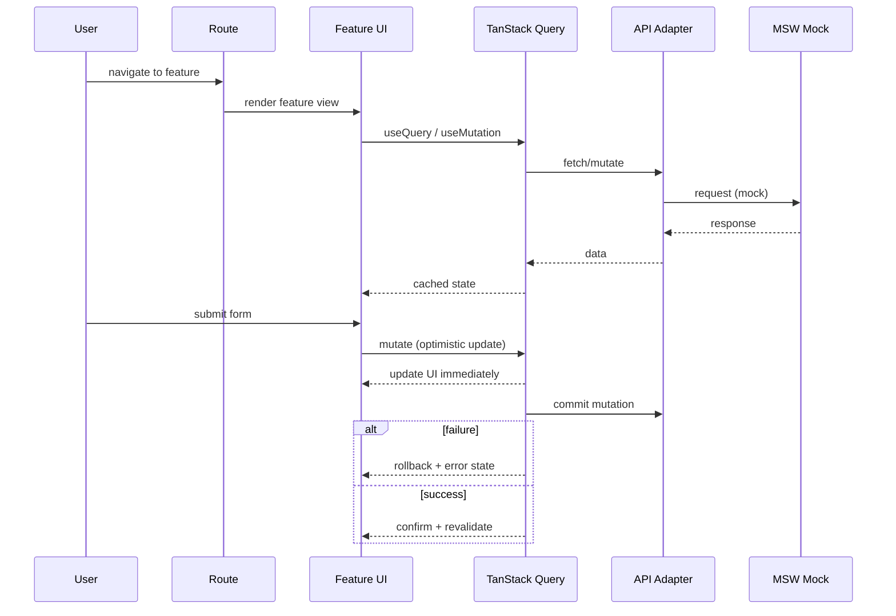
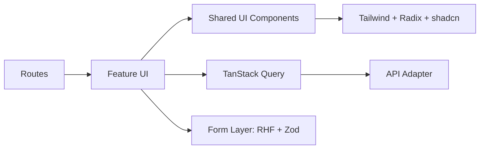

# Tanstack-MSW case — Frontend Architecture

## Architecture Overview
The UI follows a feature‑based structure: routes define entry points, features own domain‑specific UI/state, and shared UI primitives live in `components/`. Data flow uses TanStack Query for caching and mutations, with optimistic updates for fast feedback.

Key layers:
- **Routes** (`src/routes/`): composition and navigation only.
- **Features** (`src/features/`): feature UI, hooks, local state orchestration.
- **Shared UI** (`src/components/`): reusable primitives (Radix + shadcn + Tailwind).
- **Data/Adapters** (`src/api/`, `src/mocks/`): API access and MSW handlers.
- **Utilities** (`src/lib/utils.ts`): clsx + tailwind‑merge helpers.
- **URL state**: filters/sort/pagination live in route search params for back/forward consistency.

## Diagrams
### UI Request Flow (Query + Optimistic Update)

### Component Composition (Feature‑Based)

## Request/Render Flow (Step‑by‑Step)
1) Route renders a feature entry point.
2) Route search params encode filters/sort/pagination.
3) Feature hooks call TanStack Query for read/write data.
4) Data layer adapters return API data (or MSW mocks).
5) Feature composes shared UI primitives and renders.
6) Mutations run with optimistic updates; rollback on failure.

## Key Components & Responsibilities
- **Route**: wiring and navigation only.
- **Feature**: orchestration of UI + data for a domain slice.
- **Shared UI**: consistent primitives and styling.
- **Data adapters**: API access and mocking.
- **Utilities**: class composition via `clsx` + `tailwind-merge`.
- **URL state**: route search params as the single source of filter state.

## Failure Handling
- Query errors surface as explicit UI states.
- Mutations rollback optimistic cache on failure.
- Forms validate via Zod before submit to reduce bad requests.

## Operational Notes (Frontend)
- Cached data reduces re‑fetch churn.
- Optimistic updates keep UI responsive on slow networks.
- MSW supports realistic local workflows without a backend.

## Next Improvements
- Component contracts and visual regression tests.
- Shared error boundary patterns across routes.
- Query key conventions doc for long‑term consistency.
